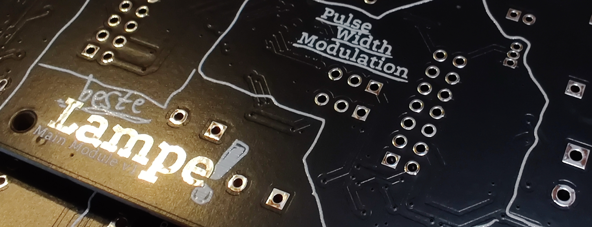
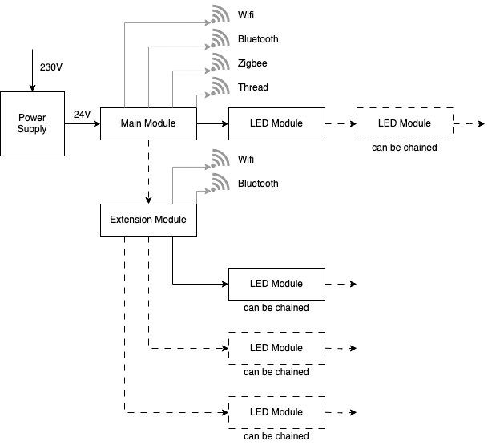
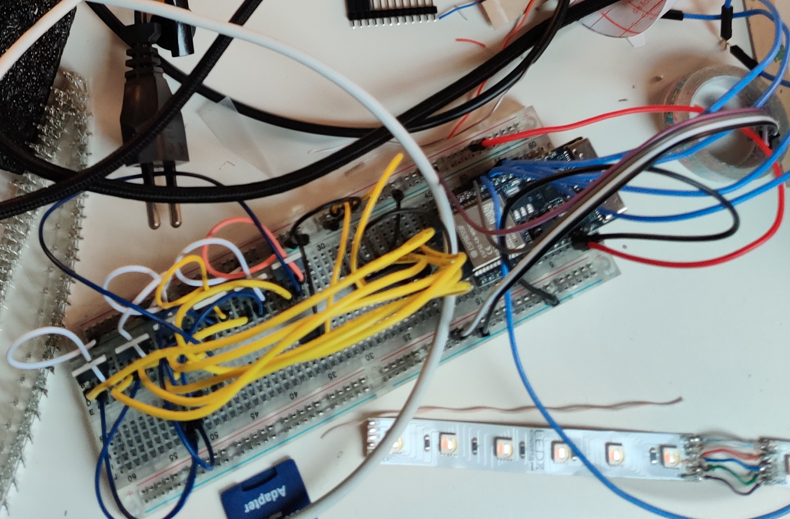
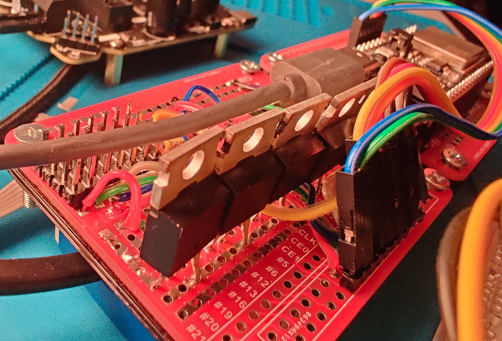
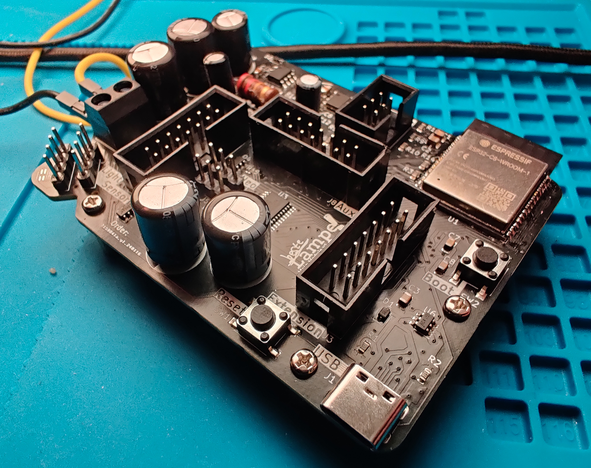

<!-- *Apart from this README, most documentation and notes are in German. If this project becomes more than a proof-of-concept, all important parts the documentation will be translated to English. The name will remain German, as it should be understandable to English speakers as well.* -->

## besteLampe!
**Most lamps suck. This is an open source hardware and software project to create not only a better lamp, but the best lamp. Or *"besteLampe!"* as we say in German.**

Of course, there are **many** kinds of lamps, and for some use cases, better alternatives exist. This one is created with two main use cases in mind:
 - indoor lamp for general room lighting and as a sunrise alarm clock 
 - outdoor lamp in front of apartments

The first case involves more direct, manual control of a single lamp, and the second case is more about automatic control (time based, responding to movement, linked with nearby lamps). Anyway, the lamp in each use case will sometimes be operated *just like in the other use case*, so both have mostly the same requirements, just with different priorities.

## What makes ~~a good~~ the best lamp?
These are the design goals of *besteLampe!* 

 - **Open** •  open hardware, open software, open protocols *(Attention: see at the very bottom)*
 - **State-of-the-art dimming** • Flicker free, smooth dimming, extremely wide contrast ratio (a.k.a "dim to zero"), independent dimming of color and brightness. (See  ["The problem with driving LEDs with PWM"](https://codeinsecurity.wordpress.com/2023/07/17/the-problem-with-driving-leds-with-pwm/) by Graham to understand what's so hard about that.)
 - **Premium color control** • Use as many color channels as needed to extend the color gamut and achieve good color quality in a reasonable range of colors. (See [the wiki page "Colors"](https://github.com/lenaschimmel/bestelampe/wiki/Colors) for the complexities involved)
 - **Smart, but not smart-ass** • Offers a wide range of wireless connection option, but is also a good, usable device when it's only connection is to the power grid.
 - **Cost efficient** • Should be less expensive than off-the-shelf smart lamps, even if they lack most of its features.
 - **Versatile** • Can be used for many different applications.
 - **Modular** • Provide many features, but not absurdly many, on the base module.
 - **Mains operated, but low voltage DC** • Don't mess with deadly AC.
 - **Power efficiency** • mostly by dimming and switching off.
 - **React to motion and presence** • IR-sensors can only detect motion, so a microwave- or mmwave-sensor must be supported.
 - **Hackable** • Over the air update, flash software and view logs via USB or UART. Pins for future expansions.
 - **Insect friendly** • Reduce the amount of light at night and offer insect friendly spectrum options.
 - **Sleep cycle aware** • Dim lights and avoid blue wavelength at night.
 - **Durable** • Should be usable for decades. Possibility to repair or replace individual parts or modules. Monitor it's own state and send warnings.
 - **Reliable** • Handle outages gracefully, no matter if power outage, network problems or minor component defects.
 - **Fun** • When all the important features are done, add some nice extras. Blinkenlighs-like light shows? UV light? Light based games? Let's do it!

*Note: The current version **strives** to achieve all of them, but I can't (yet) say whether it actually accomplishes them all.*

## Not-to-do-list
 - Battery charging, photovoltaic, etc.
 - Addressable LEDs. There is a pin called "Neopixel" but that's not really a design priority, since most addressable LEDs lack in light quality (dimming steps, CRI, flicker)

## Parts and Modules
The besteLampe! project has multiple parts. In the future, they might be moved into separate repositories. They are:

 - Hardware
   - 🟢 **[Main module](hardware/mainmodule/)** • Control board with power supply, micro controller, 6-channel PWM (pulse width modulation) dimmer and many ports. *First version shipped and tested*
   - 🔴 **Extension module** • Additional simultaneous wireless protocols, 16 additional PWM channels.
   - 🟢 **LED modules** • Stuff that actually emits light. *only handmade prototypes*
   - 🟡 **Enclosure** • To hold the electronics together, protect it from the environment, and guide the light.
 - Software
   - 🟢  **[Firmware](software/bestelampe) for main- and extension module**
   - 🟡 **Control software (Web, Desktop, Mobile, CLI, M5Paper...)**
   - 🔴 **Common code library** • The firmware and all control software variants are written in Rust and should all use a common, portable code base.

In the initial concept, hardware modules are intended like to be used like this:

- The main module with its ESP32-C6 can control one chain of LED modules (within a chain, all modules show the same color/brightness). It offers four wireless protocols, but only one or two of them can be used at the same time.
- The extension module can control up to three chains of LED modules (each chain has individual color/brightness). Its ESP32 only has two wireless protocols, but they can be used at the same time, so that a total of three protocols can be combined.

I'm currently exploring a different approach, starting with LED Module C, which might need changes to the whole modularization concept. Stay tuned...

## State of the project
### Documentation
This readme is not up-to-date. Both software and hardware are already more advanced than what the next paragraphs describe. Please look at the source code and/or the LED Modules' READMEs in the `hardware` directory to get a better impression of the current state.

### Software
The firmware is currently in a transformation from messy, quick-and-dirty proof-of-concept to a more structured and reliable architecture. It supports all hardware components of the Main Module v1 and LED Module A.

Possible next steps:
 - Move code between bestelampe (hardware-dependent) and abstraktelampe (hardware-independent)
 - Make PWM fading, 20 bit resoluition and temporal dithering are available in Rust (only partly supported by esp-idf-hal)

### Hardware
For the hardware, multiple prototypes with various degrees of sophistication exist:

I already ordered PCBs from JLCPCB for the Main Module v1, and even though they have [a lot of minor bugs](/hardware/mainmodule/README.md#Known-problems-for-v1), they look great and - even more important - are fully functional apart from the missing light sensor. **I do not recommend to order Main Module v1.** There are a lot of really easy-to-fix nuisances, so please wait for version 1.1 (see branch [`main-module-v1.1`](https://github.com/lenaschimmel/bestelampe/tree/main-module-v1.1)) or version 2. **If you really want a v1 board in your hands quickly, just contact me. I have a few spare ones (partly assembled).**

Some LED boards are also designed and have been manufactured.

I'm working on multiple enclosure designs, one based on a transparent flower pot, and one based on an existing lamp where I replace all the electronics with my own. Both contain many 3d-printed parts,  and a lot of manual labour to make them look *less 3d-printed*.

The next steps for the hardware could be:
 - Release Main Module v1.1
 - Put a second ESP32 into the prototype to test ESP-AT or similar communication between both ESPs
 - Create constant-current PWM driver for LED Board C.

 ## Price
 I've tried to estimate the prices for a complete lamp, but excluding the enclosure (because I have no idea how to estimate that). The calculation is based on ordering 100 PCBs per type, and some optimizations in Main Module v1.1, some of which are not yet done. 
 
 The two lamp configurations are:
 - **Simple:** 6 color channels (R,G,B,Warm White, Cold White, Amber). Needs the Main Module and 1 LED Module
 - **Extended:** 4*6 color channels (same colors as above, but control 4 groups independently). Needs the Main Module, Extension Module and 4 LED Modules. To drive all four groups at full brightness simultaneously, you'd need a bigger power supply.

 | **Part**                      | **Price (Euro)** | **Comment**                                    | **Count in simple lamp** | **Count in extended lamp** |
|-------------------------------|------------------|------------------------------------------------|--------------------------|----------------------------|
| Main Module v1.1              | 10.80            | incl. SMD and through-hole components          | 1                        | 1                          |
| Power supply                  | 14.00            | 15W, input 220-240V AC, output 24V DC          | 1                        | 1                          |
| Presence sensor               | 3.00             |                                                | 1                        | 1                          |
| Extension module              | 13.00            | very rough estimate                            | 0                        | 1                          |
| LED module                    | 5.70             | Assuming RGBCCT and Amber LEDs, 20 pieces each | 1                        | 4                          |
| **Sum: Simple besteLampe!**   | **33.50**        | Enclosure not included                         |                          |                            |
| **Sum: Extended besteLampe!** | **63.60**        | Enclosure not included                         |                          |                            |

 ## License
 This project *should* really be open. I have not yet decided on a license, although I lean strongly towards a copyleft-style license.
 
 I felt like this indecision should no longer stop me from publishing the project. So technically, this is not yet open hardware / free software. I'll fix that soon!
