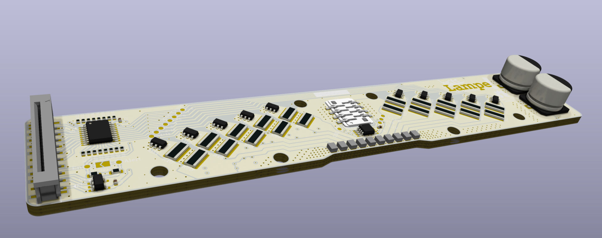

<!--
SPDX-FileCopyrightText: 2024 Lena Schimmel <mail@lenaschimmel.de>
SPDX-License-Identifier: CC-BY-SA-4.0

[besteLampe!](https://lenaschimmel.de/besteLampe!) © 2024 by [Lena Schimmel](mailto:mail@lenaschimmel.de) is licensed under [CC BY-SA 4.0](http://creativecommons.org/licenses/by-sa/4.0/?ref=chooser-v1)
-->

## LED Module E + G
The former LED Module E has been split into two separate PCBs:
 - Module E (classic 4--layer PCB with driver logic, MOSFETs and series resistor)
 - Module G (1-layer copper-core PCB with actual LEDs and temperature sensor)

In conjuction, they feature 10 small, high-powered Cree XLamp Element LEDs places close to one another along an edge, and some of the electronics needed to power them.

The split into separate PCBs is very recent, and the files have not yet been completely reorganized. Module G is still in this directory, and its files are still named "LED_Module_E_copper". They will move into their own directory soon.

### Parts on Module E
| **Part**                      | **Price (Euro)** | **Comment**                                    | **Count in simple lamp** | **Count in extended lamp** |
|-------------------------------|------------------|------------------------------------------------|--------------------------|----------------------------|
| Main Module v1.1              | 10.80            | incl. SMD and through-hole components          | 1                        | 1                          |
| Power supply                  | 14.00            | 15W, input 220-240V AC, output 24V DC          | 1                        | 1                          |
| Presence sensor               | 3.00             |                                                | 1                        | 1                          |
| Extension module              | 13.00            | very rough estimate                            | 0                        | 1                          |
| LED module                    | 5.70             | Assuming RGBCCT and Amber LEDs, 20 pieces each | 1                        | 4                          |
| **Sum: Simple besteLampe!**   | **33.50**        | Enclosure not included                         |                          |                            |
| **Sum: Extended besteLampe!** | **63.60**        | Enclosure not included                         |                          |                            |

### Relation to previous LED modules
Version 1 of this module was partly based on the failed [LED Module D](../../ledmodule/LED_Module_D/), but with a lot of changes:

 - larger board
 - re-assinged all components to the three power rails
 - removed the TLC59711 as PWM generator
 - instead 8 separate inputs for PWM signals
 - two of the input signals are duplicated to power 2 LEDs each (but with separate MOSFETs and resistors)
 - more and larger mounting holes
 - improved thermal conductance (more thermal vias, etc.)
 - optimized traces
 - optional pull-ups for the I2C bus
 - solder jumper to directly tie the alert signal of the temperature sensor to the enable input of the driver
 - added test pads
 - added bulk capacitor
 - switched to 100% SMD parts
 - LED voltage can be supplied via USB-C or via two pins of the Pin header (see below)

It was a bit larger than LED module D, but the placement of the LEDs was still the same, which proved to be a good fit for the linear half-bown reflector prototype.

Now this is version 2, which has a very different form factor. It's much larger, and the LED are on the long side instead of the short one.

### VLED
With single LEDs (parallel, in contrast to series / strings), a voltage around 4V would be a good choice for the supply voltage, so that the series resistors don't waste too much energy.

But it's surprisingly difficult to find a good source for 4V if you've got only 230V AC, 5V and 3.3V DC to work with. It seems much more straight-forward to use 5V and adjust the series resistors to it.

The CD74HCT244 needs 4.5 V to 5.5 V to operate, so it already had a 5V rail. The power rail for the LEDs was historically called 4V, and even though it's lablled `VLED` on the silkscreen now, the nets are still called 4V in Kicad. Both rails are still separate, just in case I'll find a good 4V source in the near future.

### Temperature Alert
Usually, the MCU should monitor the temperature via the TMP1075 sensor, and reduce the LED power before they get too hot. Via I2C, the MCU can read the excact temperature value.

The MCU can also set an alert threshold on the sensor, so that it will trigger its ALERT pin when the LEDs get too hot.

As an extra safety measure, the ALERT net can be linked directly to the ENABLE net via the solder jumper JP1. If the MCU has crashed, or for some other reason is not able to react to the rising temperature, this should turn off the LEDs without the MCUs intervention. This feature is untested, and the jumper is open by default.

### EEPROM addressing issue
Version 2.0 of the LED board contained an 24AA02UID, which will react to any address from 80 to 87. This prevents the usage of multiple EEPROMs on one bus. Newer versions of the LED Module and Power Module use individually addressable 24AA02**5**UID (note the slightly different part number). In software, you should first check if an EEPROM on address on 87 is present. If yes, it's on the LED Module and you can't detect / use an EEPROM on the Power Module. If no, there *should* be an EEPROM at 81 on the LED Module, and there *could* be another on on 82 on the Power module.

### Rendering
