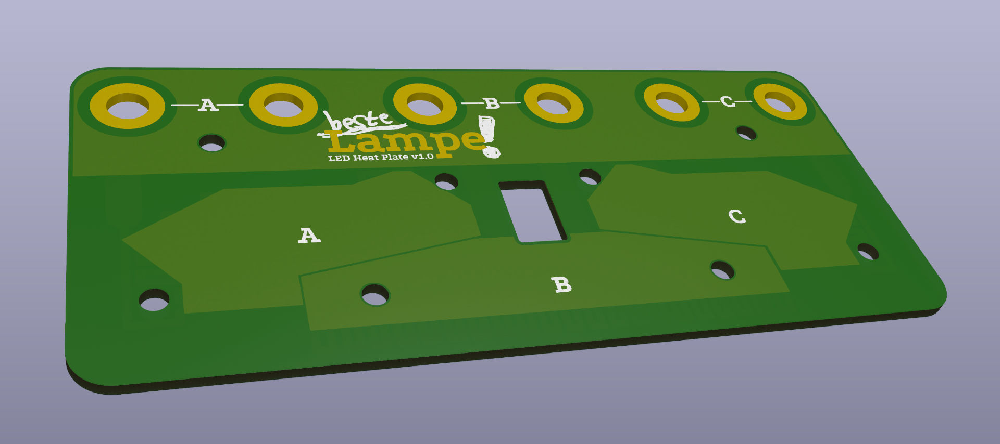

<!--
SPDX-FileCopyrightText: 2024 Lena Schimmel <mail@lenaschimmel.de>
SPDX-License-Identifier: CC-BY-SA-4.0

[besteLampe!](https://lenaschimmel.de/besteLampe!) © 2024 by [Lena Schimmel](mailto:mail@lenaschimmel.de) is licensed under [CC BY-SA 4.0](http://creativecommons.org/licenses/by-sa/4.0/?ref=chooser-v1)
-->
## ABL LED Heatplate
This PCB is a tool to facilitate soldering the [LED Module E](../LED_Module_E/). On an internal layer, it has three long resistive traces that can heat up three areas of the top side. A regular heatplate can't be used because of the central "Dual Row Inverted Thru Board Card Edge Connector".

The resistence, recommended voltage and power of this heatplate are currently unknown. I expect this to be working with 5V, but I'll have to measure once it arrives.

I will add recommendations for assembly as well.

### Rendering
