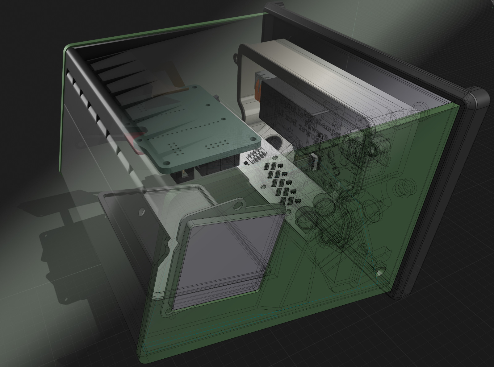

<!--
SPDX-FileCopyrightText: 2024 Lena Schimmel <mail@lenaschimmel.de>
SPDX-License-Identifier: CC-BY-SA-4.0

[besteLampe!](https://lenaschimmel.de/besteLampe!) © 2024 by [Lena Schimmel](mailto:mail@lenaschimmel.de) is licensed under [CC BY-SA 4.0](http://creativecommons.org/licenses/by-sa/4.0/?ref=chooser-v1)
-->
## besteLampe! Access Balcony Lamp (ABL)
The Access Balcony Lamp (short ABL, German "Laubengang-Lampe") will be the first device of the besteLampe! series to actually be manufactured.

## Component overview
It consists of these parts:
 - Power Module
   - [Power PCB](./power/)
 - Lamp Module 
   - [LED PCB](./LED_Module_E/)
   - [Controller PCB](./controller/)
 - Connectors between the main PCBs
   - [Rigid connector](./rigid_connector/)
   - [Flex connector](./flex_connector/)
 - Enclosure
   - Not yet online

Additional ressouces:
 - Tools
   - [LED heatplate](./LED_heatplate/)

## Voltages
The complete system has three or four different voltages / power rails:
 - **230V AC** Input voltage (power modules can be daisy-chained)
 - **5V** Output by the power module and fed through to all other modules. When the controller module is connected via USB-C, it can also source 5V from there and feed it to other components.
 - **3.3V** Supply voltage for several components. The feather module generates this from its 5V input and shares it with most other components. The power module has its own 5V-to-3.3V conversion (which is a bit strange, but probably ok and not worth changing).
 - **VLED** The voltage to drive the LEDs. This is the most significant part of the systems power consumption.

Ideally, the LEDs would be driven with 4V, but since I did not find any power supplies with that voltage, they are currently driven with 5V. For historic reasons, the net `VLED` might still be called `4V` in some places.

Event though the nets `VLED` and `5V` currently carry the same voltage from the same source, they are separate nets in theory. If we manage to find a good 4V power supply, we could create a new power module, and the other modules and connectors should just work with that. The series resistors for the LEDs should probably be replaces as well.

The README for most modules will also have complementing information about available voltages.

## I2C addresses
All modules share a common I2C bus. In the above diagram, the I2C components are highlighted by violet text.

Most devices support multiple addresses, which are selected via address pins. Some of them recognize 4 states per pin: high, low, SDA and SDC. Using static high and low for address selection seems to be more robust.

The INA219 power sensor on the power board serves an additional purpose: the address it reacts to indicates if a 20W or 30W power supply has been installed in the power module.

 - Power Module
    - 64 = 1000000: INA219 (in case of 20W power supply)
    - 65 = 1000001: INA219 (in case of 30W power supply)
    - 82 = 1010010: 24AA025UID (Starting with v1.2, may also trigger 24AA02UID on LED Module v2.0)
    - 79 = 1001111: TMP1075
 - LED Module
    - 75 = 1001011: TMP1075
    - 81 = 1010001: 24AA025UID (Starting with v2.1)
    - 87 = 1010111: 24AA02UID (Will react to any address from 80 to 87, only on v2.0)
 - Controller Module
    - 16 = 0010000: VEML6040
    - 32 = 0100000: TCA6408a (3.3V, starting with v1.1)
    - 33 = 0100001: TCA6408a (5V, starting with v1.1)
    - 67 = 1000011: FLX6408 (3.3V, only in v1.0)
    - 68 = 1000100: FLX6408 (5V, , only in v1.0 - see warning in [controller/README.md](controller/README.md))
    - 69 = 1000101: INA219
 - Feather
    - 54 = 0110110:	Battery monitor (Adafruit ESP-C6)

## Rendering
Artistic rendering showing the inside and outside of the ABL at the same time:

