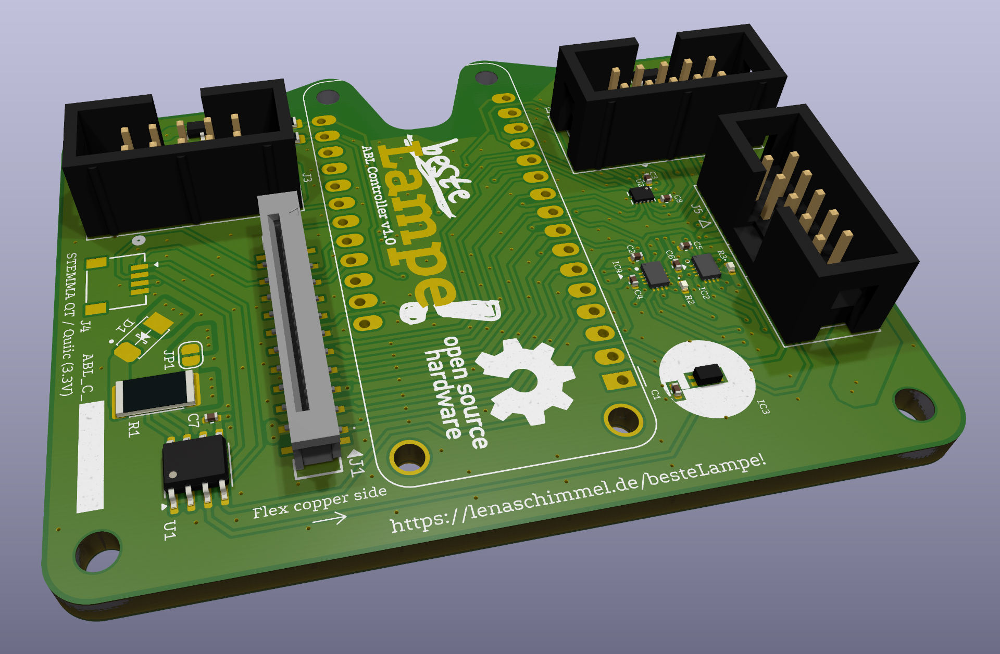

<!--
SPDX-FileCopyrightText: 2024 Lena Schimmel <mail@lenaschimmel.de>
SPDX-License-Identifier: CC-BY-SA-4.0

[besteLampe!](https://lenaschimmel.de/besteLampe!) © 2024 by [Lena Schimmel](mailto:mail@lenaschimmel.de) is licensed under [CC BY-SA 4.0](http://creativecommons.org/licenses/by-sa/4.0/?ref=chooser-v1)
-->
## ABL Controller Module
This module started out as a simple passive adapter to connect an ESP32-C6 to the LED Module and power module, but has become more complex by now.

It contains an RGB light sensor and connects to:
 - up to two human presence sensors
 - optional expansions via
   - I2C (Quiic / Stemma QT connector)
   - additional GPIOs

### Feather MCUs
The socket for the MCU has the [Adafruit Feather](https://learn.adafruit.com/adafruit-feather/overview) formfactor. There are at least three different implementations of the ESP32-C6 in this formfactor, as well as dozens of other MCUs.

The feather spec is strict enough that every kind of Feather *should* be safe to plug in, e.g. fits mechanically and will not damage itself or other modules. The specific pin assignments of feathers are different though, and care has been taken to use the pins in a way that is at least compatible with all three ESP32-C6 feathers:

**WARNING:** The above table displays the pinout for controller v1.0 but 13 and 16 changed in v1.1 - there will be an updated table later.

Obviously, the software must use specific pin assignments for each of the three feathers, and since it's not possible to detect the kind of feather at runtime, the software must be purpose-build for a specific feather.

### GPIOs
As shown in the table above, the GPIO pins can be referenced by several different names and numbers. It's recommended to use the pad number (leftmost column) or net name (rightmost column) to talk about a specific GPIO pin.

The feather does not offer enough GPIO pins for all current (and future) features, so the module contains two GPIO expanders with 8 GPIOs each. One of them is running on 3.3V logic, and its ports are called `FX_3_0` to  `FX_3_7`. The other one is running on 5V logic and has pins `FX_5_0` to  `FX_5_7`.

### Presence sensors
Up to two presence sensors can be connected to the controller (left and right).

Many different types of presence sensors shall be supported. They all communicate via UART (and 0 to 2 additional logic pins), but can have different voltage requirements:
 - 5V for power and logic
 - 5V for power, but 3.3V for logic

For this reason, both connectors each carry:
 - Ground
 - 5V supply (switched)
 - UART (RX + TX) at 3.3V
 - UART (RX + TX) at 5V
 - 2x GPIO at 3.3V
 - 2x GPIO at 5V

**WARNING:** In v1.0, I have uses `FXL6408` GPIO extenders because of availablity, but it only supports voltages up to 4.0V. One of the two chips is currently running on 5V which is not safe. Starting from version 1.1 a TCA6408ARSVR is used instead.

The left and right presence connector are independant: each has its own UART, its own GPIO pins, and the supply power for each one can be switched independantly. So you could connect two completely different sensors.

For a single presence connector, the UART pins are redundant: the 5V UART is just a logic-shifted version of the 3.3V UART. But the two 3.3V GPIOs are separate form the two 5V GPIO pins, e.g. four independant signals.

The power of the presence sensors can be switched for these reasons:
 - Each presence sensor contains its own MCU, and if it should hang/crash, we can reset it by power-cycling.
 - An advanced presence sensor can consume up to 1W continously, so we want to switch them off during the daylight to save energy.
 - To prevent interference between the two sensors in a lamp, but also with sensors from other nearby ABLs, we may need to use the sensors in turns. Some models can't be (de-)activated via UART, so we must cut their power instead.

### Other power and voltage considerations
The controller board does not directly deal with `VLED`, since it only outputs the PWM signals on 3.3V logic level.

But during testing / debugging, the controller module can be powered over USB-C. Then it will provide 5V and 3.3V to the other modules. VLED is also connected directly to 5V, unless you cut the solder jumper JP1.

When powered via USB-C, there is at most 15W available in total, compared to 20W or 30W from the power module. When the power module is disconnected, it cannot measure the current, and even if it was connected, the current from USB / VBUS does not flow through shunt resistor of the INA219 on the power module. For this reason, it is possible to place a second INA219 and shunt resistor directly onto the controller. For normal operation, this is not needed.

### Light sensor
This sensor is intended to monitor the overall light output of the LED module. The (up to) 8 different colors / spectra are mixed inside the lamp enclosure, which will be shaped to diffusely reflect the light mix onto the sensor. When all LEDs are off, the sensor might also be used to detect external (day-)light, but this is not its primary purpose.

### Additional connectors
The AUX connector (J5) and STEMMA QT / Qwiic connector (J4) can be used for debugging and/or future extensions. Both provice 3.3V supply voltage and I2C at 3.3V. The AUX connector also has VLED, 5V and four GPIOs (two at 3.3V and two at 5V).

### Rendering
