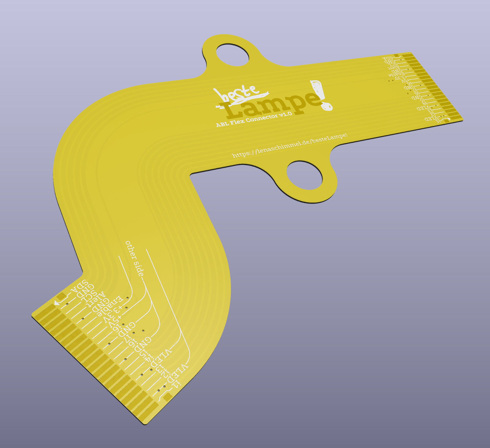

<!--
SPDX-FileCopyrightText: 2024 Lena Schimmel <mail@lenaschimmel.de>
SPDX-License-Identifier: CC-BY-SA-4.0

[besteLampe!](https://lenaschimmel.de/besteLampe!) © 2024 by [Lena Schimmel](mailto:mail@lenaschimmel.de) is licensed under [CC BY-SA 4.0](http://creativecommons.org/licenses/by-sa/4.0/?ref=chooser-v1)
-->
## ABL Flex Connector
This passive flex connector PCB connects the [controller module](../controller/) to the [LED module](../LED_Module_E/).

It carries:
 - Ground
 - I2C (SDA, SCL)
 - 3.3V
 - 5V
 - VLED
 - ALERT (temperature alert from the LED module)
 - LED_ENABLE
 - 8 PWM signals (i1 to i8)

With this kind of connector, it seems unavoidable that the pin numbers on each end differ, e.g. SDA is on pin 1 on one end and pin 20 on the other end.

Its length / shape must be re-adjusted to the encloure, because the position of the controller module has changed recently.

In normal operation, VLED is not needed on the controller boards, so the trace is not used. When powerd (exclusively) over USB-C, the LED module gets VLED from the controller module. The trace is 3mm wide, which (depending on copper thickness) may or may not be enough to conduct the full 15W that USB-C may provide.

### Rendering
