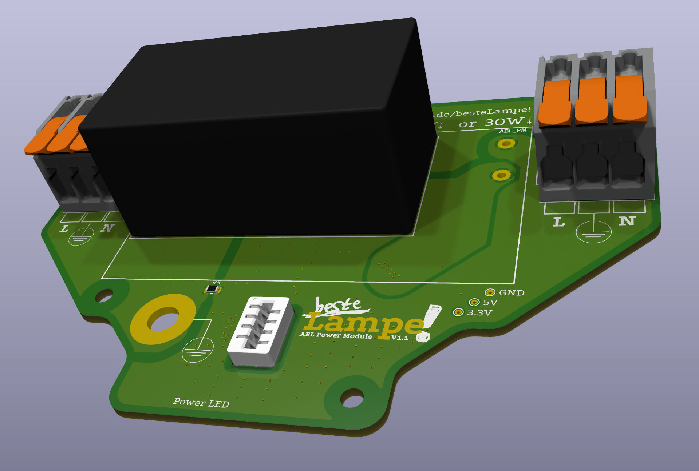
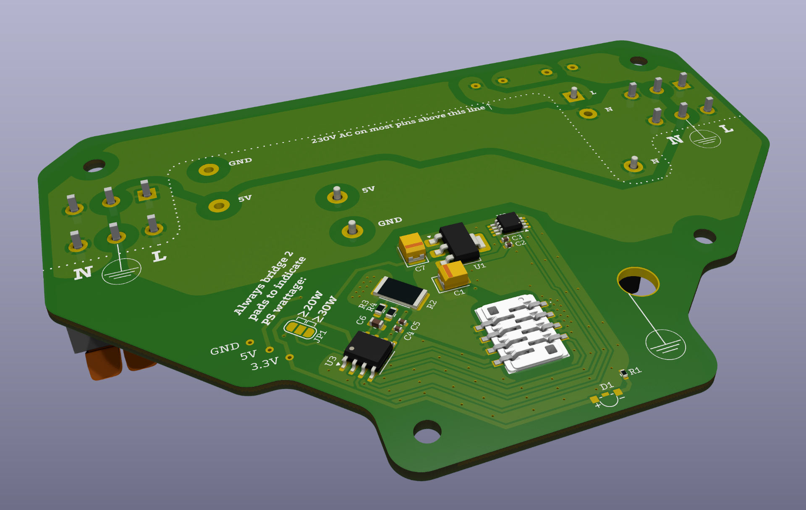

<!--
SPDX-FileCopyrightText: 2024 Lena Schimmel <mail@lenaschimmel.de>
SPDX-License-Identifier: CC-BY-SA-4.0

[besteLampe!](https://lenaschimmel.de/besteLampe!) © 2024 by [Lena Schimmel](mailto:mail@lenaschimmel.de) is licensed under [CC BY-SA 4.0](http://creativecommons.org/licenses/by-sa/4.0/?ref=chooser-v1)
-->
## ABL Power Module
This module contains:
- two sets of 230V terminals with PE
- 20W or 30W power supply (PS)
- temperature sensor
- power sensor (voltage and current)
- status LED

The power module does not monitor its own sensors. The controller module should do this, and drive the LEDs in a way that does not exceed the current and temperature limits of the PS. The power module has its own 3.3V buck converter. It does neither supply 3.3V to the other modules, nor does it receive 3.3V from them.

You can solder in either a 20W or 30W PS. You must bridge two pads of the solder jumper to indicate which PS is present. This affects the I2C address of the power sensor, which allows us to communicate this bit of information to the controller without an extra wire. For the specific I2C addresses of the sensors, see the README in the [parent directory](../README.md).

Ground and PE are separate, but could be connected by placing the resistor R5. I've extrapolated from [this toot/thread about USB grounding](https://mastodon.social/@tubetime/113036756672478830) that it might be a good idea.

### Rendering

