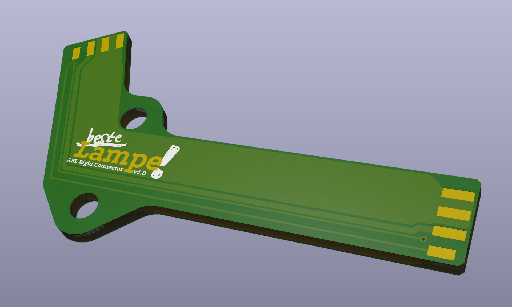

<!--
SPDX-FileCopyrightText: 2024 Lena Schimmel <mail@lenaschimmel.de>
SPDX-License-Identifier: CC-BY-SA-4.0

[besteLampe!](https://lenaschimmel.de/besteLampe!) © 2024 by [Lena Schimmel](mailto:mail@lenaschimmel.de) is licensed under [CC BY-SA 4.0](http://creativecommons.org/licenses/by-sa/4.0/?ref=chooser-v1)
-->
## ABL Rigid Connector
This passive connector PCB connects the [power module](../power/) to the [LED module](../LED_Module_E/).

It has separate traces for 5V (0.6mm width) and VLED (5.5mm width), and also carries I2C.

Unless it is inserted from a wrong angle, gound connects first, then 5V and VLED, and last I2C (SDA and SCL).

### Rendering
