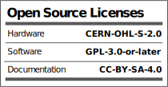

<!--
SPDX-FileCopyrightText: 2024 Lena Schimmel <mail@lenaschimmel.de>
SPDX-License-Identifier: CC-BY-SA-4.0

[besteLampe!](https://lenaschimmel.de/besteLampe!) © 2024 by [Lena Schimmel](mailto:mail@lenaschimmel.de) is licensed under [CC BY-SA 4.0](http://creativecommons.org/licenses/by-sa/4.0/?ref=chooser-v1)
-->

## License
The besteLampe! is open hardware: 

- The hardware design is licensed under [CERN-OHL-S v2](https://ohwr.org/cern_ohl_s_v2.txt) or any later version.
- The software is licensed under [GNU General Public Licence v3.0](https://creativecommons.org/licenses/by-sa/4.0/legalcode) or later
- The documentation is licensed under [Creative Commons Attribution Share Alike 4.0 International](https://creativecommons.org/licenses/by-sa/4.0/)



All licenses are available in this directory.

## Standard header for hardware design files
```
SPDX-FileCopyrightText: 2024 Lena Schimmel <mail@lenaschimmel.de>
SPDX-License-Identifier: CERN-OHL-S-2.0+
This source describes Open Hardware and is licensed under the CERN-OHL-S v2.
You may redistribute and modify this source and make products using it under the terms of the CERN-OHL-S v2 ( https://ohwr.org/cern_ohl_s_v2.txt ).
This source is distributed WITHOUT ANY EXPRESS OR IMPLIED WARRANTY, INCLUDING OF MERCHANTABILITY, SATISFACTORY QUALITY AND FITNESS FOR A PARTICULAR PURPOSE. Please see the CERN-OHL-S v2 for applicable conditions.
Source location: https://lenaschimmel.de/besteLampe!
As per CERN-OHL-S v2 section 4, should You produce hardware based on this source, You must where practicable maintain the Source Location visible on the products you make using this Source, specifially:
 - on at least one printed circuit board inside the product
 - on the external case of the product, if that case is not made in a way that makes it obvious how it can be opened, or if you use practical or legal means to prevent or discourage the user from opening the case, or if the product does not contain a suitable printed circuit board to show the Source Location
```

## Standard header for software source files
```
// SPDX-FileCopyrightText: 2024 Lena Schimmel <mail@lenaschimmel.de>
// SPDX-License-Identifier: CERN-OHL-S-2.0+
// This file is part of besteLampe!.
// 
// besteLampe! is free software: you can redistribute it and/or modify it under the
// terms of the GNU General Public License as published by the Free Software Foundation, 
// either version 3 of the License, or (at your option) any later version.
// 
// besteLampe! is distributed in the hope that it will be useful, but WITHOUT ANY WARRANTY; 
// without even the implied warranty of MERCHANTABILITY or FITNESS FOR A PARTICULAR PURPOSE. 
// See the GNU General Public License for more details.
// 
// You should have received a copy of the GNU General Public License along with besteLampe!.
// If not, see <https://www.gnu.org/licenses/>. 
```

## Standard header for documentation files
```
<!--
SPDX-FileCopyrightText: 2024 Lena Schimmel <mail@lenaschimmel.de>
SPDX-License-Identifier: CC-BY-SA-4.0

[besteLampe!](https://lenaschimmel.de/besteLampe!) © 2024 by [Lena Schimmel](mailto:mail@lenaschimmel.de) is licensed under [CC BY-SA 4.0](http://creativecommons.org/licenses/by-sa/4.0/?ref=chooser-v1)
-->
```